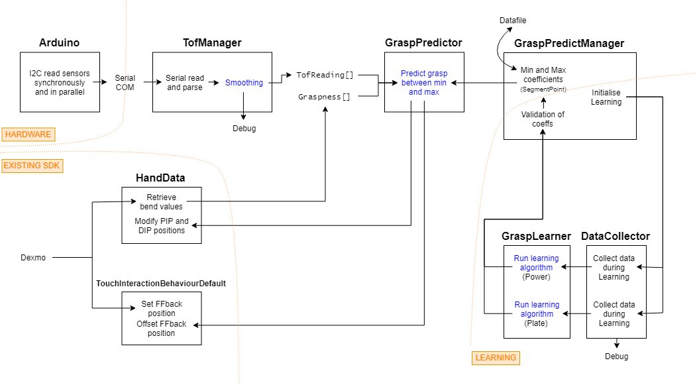
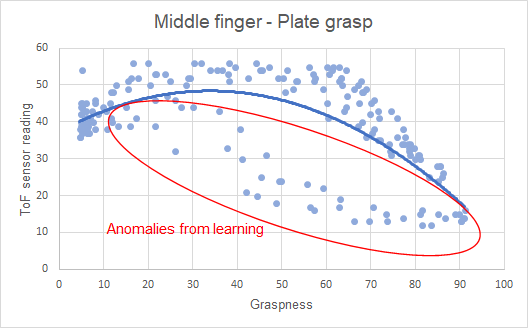
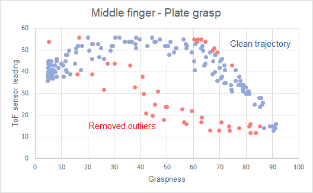
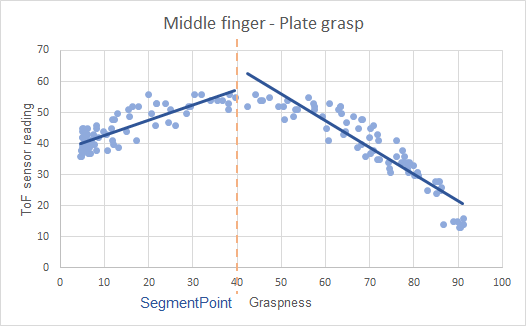
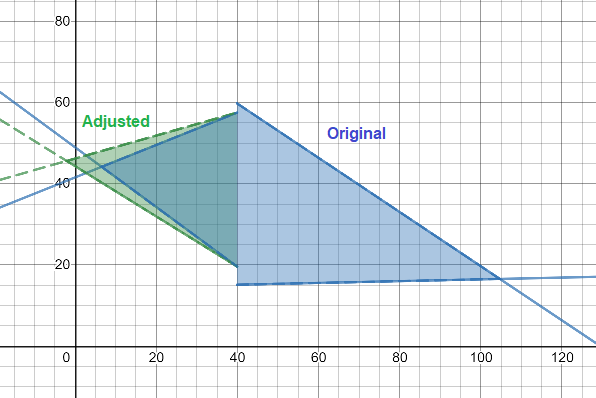
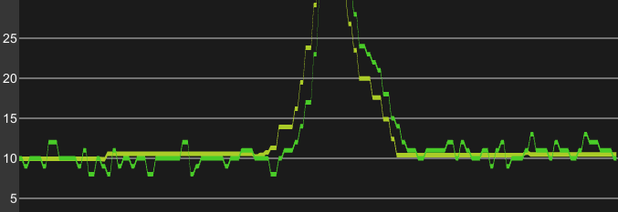

##Layout of flow of sensor data and description of algorithms##

**Overall Flowchart**

Also see [Hardware](TofHardware.md)

**Description of Grasp Prediction algorithm** 

`GraspPredictor.PredictGrasp`

1. Retrieve sensor reading from `TofManager.TofReading`
2. Retrieve max and min coefficients for correct finger and segment (whether graspness < or > segment point) from `GraspPredictManager.GraspTofCoeffsMax[finger][segmentIndex]` and `GraspPredictManager.GraspTofCoeffsMin[finger][segmentIndex]`
3. From the polynomials  given by the coefficients, calculate `f_max(graspness)` and `f_min(graspness)`
4. Find ToF reading as linear percentage between min and max
5. Remap the min-max range for more realistic model
6. Clamp value so can't get unachievable hand grasps

**Description of Learning/Regression algorithm** 

`GraspPredictManager.Update` and `GraspLearner.LearnGrasp`

1. Data collected into `DataCollector` as grasp trajectory is performed, giving data of sensor reading against bend value. There may be anomalies present (away from main grasp trajectory):

	

2. Outliers removed by applying quadratic regression on entire dataset and removing points > 2*standard deviation away from regression, and repeat, to obtain a clean trajectory on the graph.

	

3. The data is segmented into two halves from `XXX_SegmentPoint` and linear regression applied on each segment. The coefficients are stored in `GraspPredictManager.GraspTofCoeffsXXX[finger][segmentIndex]` depending on the current grasp being learned.

	

4. Once both Power and Plate have been learned, `GraspPredictManager` validation algorthm adjusts the coefficients so that the curves only intersect <0 and >100 so that the prediction space is always valid.

	

**Description of ToF sensor smoothing algorithm**

`TofManager._cacheReturnFilteredReadings`

1. Parse comma separated data strings of sensors' values from serial buffer (see [Hardware](TofHardware.md)) into array.
2. For each finger, apply exponential recursive filter with new reading and previous cache value: `filtered = k * previous + (1-k) * new` where `k` is a constant. Note a higher `k` means a more stable value but with a bigger lag between the raw and output data.
3. Remove glitches (random fluctuations)
	1. Because the noisy signal's mean is assumed to be the true value, `tofMovements` tracks each each positive and negative fluctuation step and is centred around zero. For small fluctuations the signal is assumed static and the signal is anchored to a cache value.
	2. If the fluctuation step is too large, or the absolute `tofMovements` value exceeds a threshold in any direction, the signal is assumed to have started properly changing, and the anchor is released until the signal fluctuates in the other direction again.  
4. Output to `TofManager.TofReading`

*ToF data before (green) and after (yellow) filter and glitch removal*