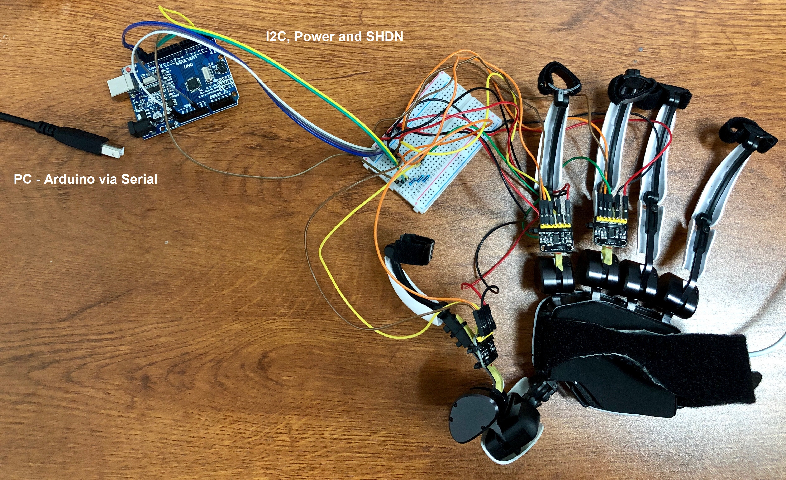
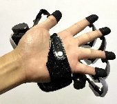
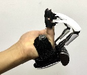
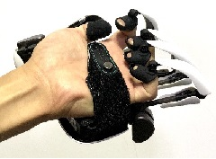
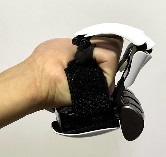
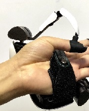
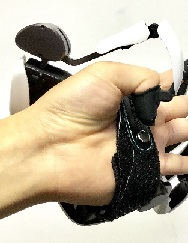
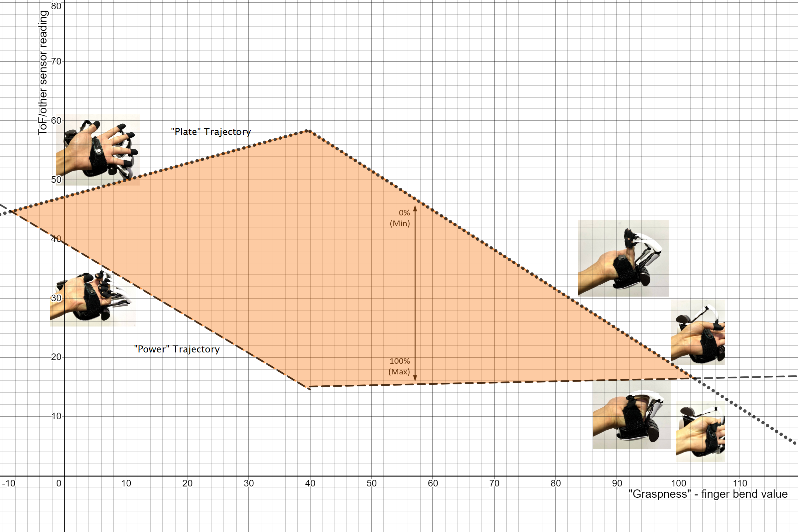
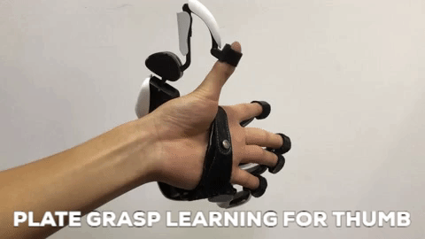

## Adding additional sensor readings to predict different grasp postures in Dexmo SDK - Overview##

By adding an additional sensor on each finger, the SDK can differentiate between grasps with different interphalangeal (IP) joint positions, for example holding a book or holding a cylinder.

###Principle###

Virtual fingers currently only follow one given trajectory with Dexmo, the power grasp (grasping a cylinder). Adding an additional sensor lets Dexmo independently measure finger PIP joints. 

Now any grasp can be expressed as a percentage between the **"power"** grasp (IP joints fully bent) and **"plate"** grasp (IP joints fully unbent):

*Plate trajectory (minimum):*

 (open hand) ->   (bend max but IP joints still completely straight)

*Power trajectory (maximum):*

 (hook grasp) ->  (fist, IP joints always fully bent)

The thumb's movements are learnt separately but the idea is the same:

*Thumb Plate* (IP joint completely straight)

*Thumb Power* (IP joint completely bent)

Therefore for any given ToF reading and finger bend value, a grasp can be predicted between the minimum and maximum trajectories:

The curves representing the maximum and minimum trajectories are obtained from the regression algorithm. 

**Representation in code**

Note that the sensor data processing is completely decoupled, so any sensor can be used instead of ToF, and its sensor data output to array, like `TofManager.TofReading` .

- `double[][][] GraspPredictManager.GraspTofCoeffsMax` stores Power (MAX) trajectory coefficients as array of 5 fingers, 2 segmented regressions, and polynomialorder+1 coeffs

- `double[][][] GraspPredictManager.GraspTofCoeffsMin` stores Plate (MIN) trajectory coefficients as array of 5 fingers, 2 segmented regressions, and polynomialorder+1 coeffs
- `float[] TofManager.TofReading` stores the continuously updated smoothed ToF sensor readings
- `float[] TofManager.Graspness` stores the continuously updated finger bend value readings
- `FingerData.MyGraspPredictor.PredictGrasp(float)` returns grasp prediction between plate (min, returns 0) and power (max, returns 100) for given graspness value and according to current ToF reading 

**Demo**

1. Plug in Arduino to PC and connect Dexmo.
2. Check Arduino found all sensors in Arduino IDE (see [Hardware](TofHardware.md)).
3. In Demo game, press `A` to read previously learnt calibration coefficients from file.
4. **Learning** Press `C` to clear loaded coefficients to start learning new. This is important so the current coeffs don't affect the new ones as they are learnt. There are 4 learning procedures in total:
	- Press `J` to initialise learning data collection for power grasp for fingers (keep IP joints fully bent)
	
	- Press `K` to initialise learning data collection for plate grasp for fingers (keep IP joints fully straight)
	
	- Press `N` to initialise learning data collection for power grasp for thumb (keep IP joint fully bent)
	
	- Press `M` to initialise learning data collection for plate grasp for thumb (keep IP joint fully straight)
	
4. Press `S` to save coefficients to file 