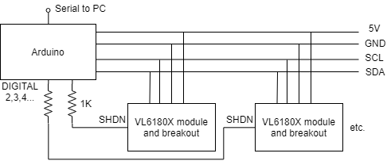
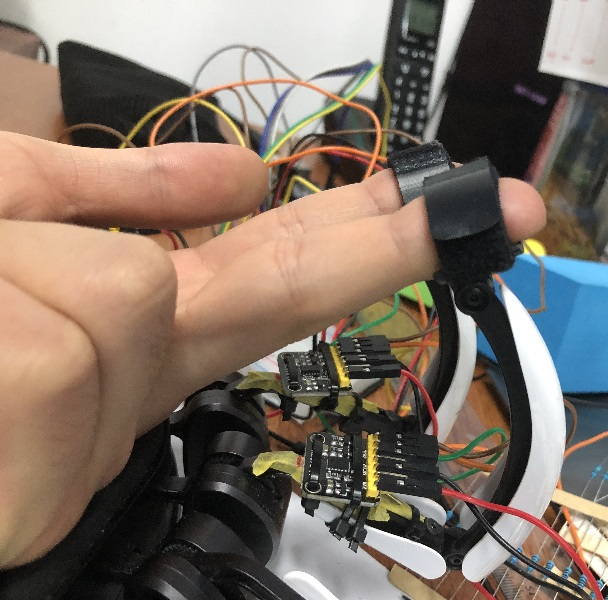
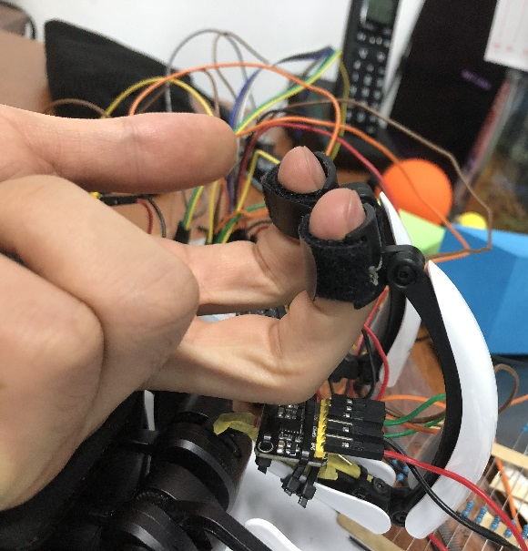

## ToF Sensor Hardware and Comms ##

This project uses [sensor boards](https://detail.tmall.com/item.htm?spm=a230r.1.14.13.45777c91RXfMan&id=584324786648&cm_id=140105335569ed55e27b&abbucket=9) which are based on the [VL6180X](https://cdn-learn.adafruit.com/assets/assets/000/037/608/original/VL6180X_datasheet.pdf) module.

An Arduino controls the sensors and is connected to PC via serial, default baud rate 115200.

The sensors communicate with I2C and take 2.8V supply, and the board has a level shifter which can take Arduino 5V or 3V3. The sensors connect directly into the same SCL and SDA pins on Arduino and each sensor SHDN (shutdown) pin is connected to an Arduino digital out pin.

The `TofSensorArduino.ino` script runs on Arduino, which sets sensors up on reset and writes to Serial. The sensor settings and functions are implemented in `VL6180.cpp`. This is based off the [examples](https://pan.baidu.com/s/1U_owJqJ-0z2ErWi6oIawVQ) shipped with the sensor (password `dekp`).

On reset:

- All sensors are shutdown via SHDN pin
- Sensor individually booted and set to a different I2C address.
- If an error occurs, ConnectionError will be output.

In the loop:

- Sensors single-shot ranging is commenced on each sensor 
- Each sensor is polled until all readings are ready.
- Readings output together as a comma separated line: 

`range0,range1,range2,range3,range4`

- If error encountered after single-shot ranging, this is non-fatal (i.e. error due to no target detected) and a cache value is output instead.

**ConnectionError at I2C intended address**

- Reset Arduino via hardware
- Check SHDN pin is pulled high after connection attempted.

**ToF Sensor placement**

Needs to detect difference between bent PIP and straight PIP for most finger bend values. Note the difference in distances between the ToF sensor and the finger PIP joint positions in the following situations:  

*Plate grasp: finger PIP far away from ToF sensor*

*Power grasp: finger PIP closer to ToF sensor*